# iOS相关

目录
[Objective-C](#objective-c)

+ [1. 语言特点](#1-语言特点)

+ [2. 面向对象](#2-面向对象)

+ [3. 引用计数](#3-引用计数)

+ [4. Block](#4-block)

+ [5. 多线程](#5-多线程)

+ [6. 运行时Runtime](#6-运行时runtime)

[Swift](#swift)

[iOS开发](#ios开发)

+ [1. Foundation](#1-foundation)

+ [2. Runloop](#2-runloop)

+ [3. UIKit](#3-uikit)

+ [4. 通知](#4-通知)

+ [5. 数据持久化](#5-数据持久化)

+ [6. CocoaPods](#6-cocoapods)

+ [7. 第三方库](#7-第三方库)

## Objective-C

### 1. 语言特点

#### 1.1 简介

Objective-C(简称oc、objc)是基于C语言、高级、面向对象的编程语言，通过引入SmallTalk式消息传递机制，实现了面向对象的机制，因此OC是C的超集。

#### 1.2 特性

##### 1.2.1 弱类型

在编写程序时，若出现静态类型不匹配，编译器会发出警告，但不会阻止编译。

```objective-c
// 将NSString赋给NSUInteger
// warning: Incompatible pointer to integer conversion
// initializing 'NSUInteger' with an expression of type 'NSString *'
NSUInteger number = @"abcd";
```

##### 1.2.2 动态类型

OC中有id类型，类似于C中的 `void *` ，可以指向任意 **对象**，其类型的确定在运行时中完成。

  ```objective-c
  // 指向一个Person对象实例
  id ptr = [[Person alloc] init];
  // 结果为Person
  NSLog(@"%@", [ptr class]);

  // 指向一个Car对象实例
  ptr = [[Car alloc] init];
  // 结果为Car
  NSLog(@"%@", [ptr class]);
  ```

##### 1.2.3 动态绑定

OC调用对象方法的方式是消息传递机制 `objc_msgSend` ，消息的接收者如何响应消息需要在运行时确定，与C++中调用虚函数的过程类似。
objc_msgSend通过receiver自身类型的 `isa指针` 在类中进行方法查找，先在 `方法缓存(cache)` 中查找，若未命中则进入类的 `方法列表(method_list)` 中查找；在本类中未得到结果，再向父类发起查找，直至找到或进入根类型。

  ```objective-c
  // 可能在receiver自身中找到响应方法，有可能在父类中找到，也有可能无法响应
  [receiver send:msg];
  // 转写为objc_msgSend(receiver, @selector(send:), msg);
  ```

##### 1.2.4 动态加载

得益于运行时系统，OC可以在运行时期间创建新的 `类(Class)` ，对 `属性(property)` 和 `方法(method)` 进行查询、添加、修改。
>运行时内容详见[运行时Runtime](#6-运行时runtime)

### 2. 面向对象

#### 2.1 与C++的异同

+ 同

  + OC和C++都是基于C的、面向对象的高级语言
  + OC和C++都允许子类重写父类方法，然后实现动态绑定
  + ... ...

+ 异
  
  + C++允许多重继承

    ```cpp
    class A : public B, public C, public D {
        // 定义
    };
    ```

    OC不允许直接继承多个类，但可以继承多个协议

    ```objective-c
    @interface A : NSObject<B, C, D>
    // 定义
    @end
    ```

  + OC的对象只能动态分配在堆上

    ```objective-c
    // 动态分配在堆上
    Person *p = [[Person alloc] init];
    ```

    C++的对象可以动态分配在堆上，也可以静态分配在栈上，还可以动态分配在栈上。

    ```cpp
    // 动态分配在堆上
    Person *p1 = new Person;
    // 静态分配在栈上
    Person p2;
    // 动态分配在栈上
    char bytes[128];
    Person *p3 = new(bytes) Person;
    ```

  + OC调用方法是消息传递机制，因此向空指针(nil)发送消息不会报错，而在C++中会崩溃
  + OC有一套运行时系统，可以在运行期间获取类的相关信息(类名等)，C++不行
  + C++允许重载方法，OC不行
  + ARC(自动引用计数)是OC内存管理的 **特性** ，但在C++中只是众多 **工具** 中的一套
  + C++传递对象时可以值传递、引用传递、指针传递、所有权传递，OC只能指针传递
  + ... ...

#### 2.2 定义和实现

##### 2.2.1 **@interface**

类的定义，也被称为 **接口** 。所有的类都继承自NSObject。
在 **.h文件** 中编写时，可以定义 **公有** 的属性(property)和方法(method)，也可以使用限定符 `@public` 、 `@private` 、 `@protected` 和 `@package` 手动指定成员变量(ivar)的访问控制。
<br>

##### 2.2.2 **@implementation**

对定义的实现，除了已有定义的方法，还可以实现未在接口中定义的 **“私有”** 方法。
><font color=PaleVioletRed>注意</font>
>OC并没有真正意义上的 **私有** 属性和方法，所谓的 **公有** 属性和方法是通过 **.h文件** 暴露出去的，因此在 **.m文件** 中，不管使用什么限定符来修饰新定义的成员变量，它都是 **私有** 的。

#### 2.3 属性(@property)

##### 2.3.1 属性修饰符

| 属性名 | 属性类型 | 用途 |
| :------: | :------: |:-------|
| atomic | 线程安全 | 默认，对ivar的访问为原子操作，线程安全但耗费系统资源，不建议使用 |
| nonatomic | 线程安全 | 对ivar的访问为非原子操作，线程不安全但访问效率高 |
| readwrite | 读写 | 默认，生成getter/setter方法 |
| readonly | 读写 | 只读，仅生成getter方法，但可以通过KVC修改 |
| assign | 内存管理 | MRC环境默认 <br> 1. 对于基本数据类型，就是简单赋值 <br> 2. 对于对象类型，约等于unsafe_retain，使用时会给出警告 |
| retain | 内存管理 | 持有对象，计数+1，仅在MRC环境下使用，ARC环境下会报错 |
| copy | 内存管理 | 复制对象，生成一个新的、计数为1的对象，需要遵守NSCopying协议 |
| strong | 内存管理 | ARC环境默认 <br> 强引用，仅在ARC环境下使用，计数+1 |
| weak | 内存管理 | 弱引用，仅在ARC环境下使用，计数不会+1，对象销毁后会置nil |
| unsafe_retain | 内存管理 | 不持有，仅在ARC环境下使用，计数不会+1，对象销毁后不会置nil |

##### 2.3.2 @synthesize

为属性指定一个成员变量名，默认成员变量名为在属性名前加一个下划线(_)

  ```objective-c
  // 默认
  @synthesize pName = _pName;

  // 手动指定 xName 为 pName 的成员变量名
  @synthesize pName = xName;
  ```

##### 2.3.3 @dynamic

告诉编译器，属性的setter与getter方法由用户自己定义并实现，不自动生成。

#### 2.4 类目(Category)

在不修改类原有内容的基础上，为类添加方法，可以为系统类添加方法。
><font color=PaleVioletRed>注意</font>
>在程序运行中，类目所添加的方法将通过运行时系统，加入到原有类的方法列表中。由于对象的内存分配在运行时已经确定，因此添加的属性只有getter/setter方法，没有实际的成员变量。如果需要添加属性，需要通过运行时系统的关联对象实现。

一般将类目文件命名为 **类名+添加方法名.h/m**

```objective-c
// NSString+Reserve.h
@interface NSString (Reserve)

- (void)Reserve;

@end

// NSString+Reserve.m
@implementation NSString (Reserve)

- (void)Reserve {
    // do something
}

@end
```

#### 2.5 扩展(Extension)

可以看作是一种无名的类目，只能存放在 **.m文件** 中，因此，扩展实际上是对类添加了 **私有** 属性和方法。不能对系统类进行扩展。

><font color=PaleVioletRed>注意</font>
>扩展的内容在编译期就已经与原有类合并，因此添加的方法一定要实现，在运行时处理的类目就没有这个限制。

```objective-c
// Person.m
@interface Person ()
// 为Person类型添加address属性 
@property (nonatomic, strong) NSString *address;

@end
```

#### 2.6 协议(@protocol)

协议是方法声明的集合，分为 **必须实现(@required)** 和 **可选实现(@optional)** 。
OC不允许多继承，但可以继承多个协议。
在需要时，可以使用协议对属性和参数进行约束，例如常见的 `id<NSCopying>`。

```objective-c
// 定义协议, 继承自NSObject协议
@protocol proT<NSObject>
// 必须实现
@required
- (void)method1;

// 可选实现
@optional
- (void)method2;

@end

// 继承proT, NSCopying协议
@interface classT : NSObject<proT, NSCopying>

- (void)method1;

@end 
```

#### 2.7 KVC/KVO

##### 2.7.1 KVC

KVC是Key-Value-Coding的缩写，即键值编码，KVC提供了一种间接访问属性和成员变量的机制，可以通过字符串来访存对应的属性和成员变量，不受限定符(例如 `@private`、`readonly` )的影响。

###### KVC写方法流程


###### KVC读方法流程


##### 2.7.2 KVO

KVO是Key-Value-Observing的缩写，即键值监听，KVO提供了一套基于观察者模式的事件通知机制。KVO可以是一对一、一对多的。

+ KVO使用
  + 注册监听 `addObserver:forKeyPath:options:context:`
  + 监听回调 `observeValueForKeyPath:ofObject:change:context:`
  + 移除监听 `removeObserver:forKeyPath:`
<br>

+ KVO本质
  + 注册了对象A的观察后，利用运行时系统动态生成一个子类 `NSKVONotifying_A` ，并且让对象A的 `isa` 指向这个全新的子类。
  + 重写子类的 `setter` 方法。
  + 修改对象A的属性时，先调用子类的 `setter` 方法。
    + 调用 `willChangeValueForKey:` 方法
    + 调用 `父类` 即对象A的 `setter` 方法
    + 调用 `didChangeValueForKey` 方法，并触发监听回调
    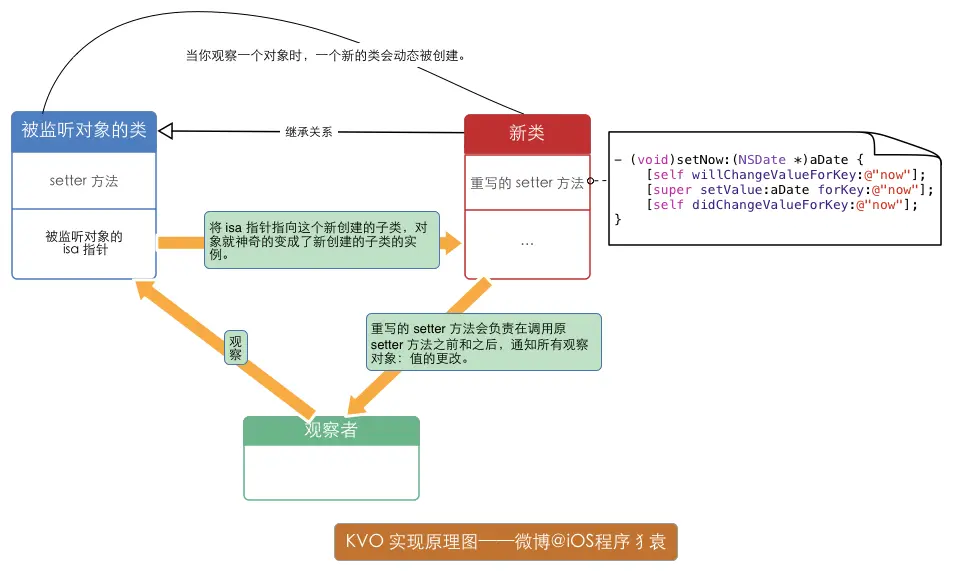

### 3 引用计数

> 可以对比阅读Swift的 引用计数 部分

#### 3.1 基本概念

引用计数是一种内存管理机制，一般用于管理对象类型的生命周期，在OC中用于管理OC对象。
一个对象的引用计数大于0时，表示这个对象被持有，不能被释放；当引用计数为0时表示这个对象已经不被持有，需要释放并回收内存。

##### 3.1.1 原理

相较于C++中shared_ptr的非侵入式实现，OC中的引用计数是混合式的，存储在对象内的 `isa指针` 和外部的 `SideTable` 中。

```c
union isa_t 
{
    isa_t() { }
    isa_t(uintptr_t value) : bits(value) { }
 
    Class cls;
    uintptr_t bits;
    # if __arm64__ // arm64架构
#   define ISA_MASK        0x0000000ffffffff8ULL
#   define ISA_MAGIC_MASK  0x000003f000000001ULL
#   define ISA_MAGIC_VALUE 0x000001a000000001ULL
    struct {
        uintptr_t nonpointer        : 1;
        uintptr_t has_assoc         : 1;
        uintptr_t has_cxx_dtor      : 1;
        uintptr_t shiftcls          : 33;
        uintptr_t magic             : 6;
        uintptr_t weakly_referenced : 1;
        uintptr_t deallocating      : 1;
        uintptr_t has_sidetable_rc  : 1;
        uintptr_t extra_rc          : 19;

#       define RC_ONE   (1ULL<<45)
#       define RC_HALF  (1ULL<<18)
    };
}
```

当 `nonpointer` 为 `0` 时，表明是未经过优化的，对象的引用计数直接存放在 `SideTable` 中。

当 `nonpointer` 为 `1` 时，表明是经过优化的，对象的引用计数优先存储在 `extra_rc` 中，最多可以存储 $2^{19}=524288$ 次计数，当 `extra_rc` 存放不下时，将 `has_sidetable_rc` 置1，使用 `SideTable` 存放更多的计数。

```c
struct SideTable {
    spinlock_t slock;
    RefcountMap refcnts;
    weak_table_t weak_table;
    void lock() { slock.lock(); }
    void unlock() { slock.unlock(); }
    void forceReset() { slock.forceReset(); }
    // Address-ordered lock discipline for a pair of side tables.
    static void lockTwo(SideTable *lock1, SideTable *lock2);
    static void unlockTwo(SideTable *lock1, SideTable *lock2);
};
```

通过 `Sidetable` 中的 `RefCountMap` ，从hash表来查找某个对象的引用计数，进而对引用计数进行操作。

#### 3.2 手动引用计数(MRC)

##### 3.2.1 对象计数操作

| 对象操作 | OC方法 | 计数变化 |
| :------: | :------- | :------- |
| 生成并持有 | alloc/new/copy | +1 |
| 持有 | retain | +1 |
| 释放 | release | -1 |
| 自动释放 | autorelease | 释放池销毁时，-1 |
| 获取计数 | retainCount | / |

##### 3.2.2 自动释放池

首先， `autorelease` 与 `ARC` 没有任何联系，是两种不同的东西， `autorelease` 并没有影响对象的引用计数，只是提供了延迟释放的机制。

自动释放池 `autoreleasepool` 就相当于C语言中的作用域，当域中的局部变量超出作用域时，这些变量就会被销毁，不过与C语言不同的是，自动释放池的作用域边界需要手动设定。

```objective-c
int main(int argc, const char * argv[]) {
    // 新建自动释放池
    NSAutoreleasePool *pool = [[NSAutoreleasePool alloc]init];
    id obj1 = [[NSObject alloc] init];
    // obj1 加入自动释放池
    [obj1 autorelease];

    id obj2 = [[NSObject alloc] init];
    // obj2 加入自动释放池
    [obj2 autorelease];

    // 销毁自动释放池
    [pool drain];
    // obj2 和 obj1 被 release
    return 0;
}
```

等价于

```objective-c
int main(int argc, const char * argv[]) {
    // 新建自动释放池
    @autoreleasepool {
        id obj1 = [[NSObject alloc] init];
        // obj1 加入自动释放池
        [obj1 autorelease];

        id obj2 = [[NSObject alloc] init];
        // obj2 加入自动释放池
        [obj2 autorelease];
    }
    // 销毁自动释放池
    // obj2 和 obj1 被 release
    return 0;
}
```

><font color=PaleVioletRed>注意</font>
>自动释放池不单单是受显式销毁的控制，有时还要考虑到Runloop的影响。
>详见 [Runloop的运行](#24-runloop的运行) 一节。

#### 3.3 自动引用计数(ARC)

`ARC` 只是比 `MRC` 多了一步，在编译期编译器自动添加 `retain` 、 `release` 和 `autorelease` 的调用，底层的内存管理机制还是和 `MRC` 一样。
因此，在ARC环境下进行编写时，以上三种方法是不能调用的，使用 `@selector()` 间接调用也不行。

##### 3.3.1 __strong

在ARC环境下，所有的指针默认为strong类型，即强引用，指向对象时引用计数+1。

##### 3.3.2 __weak

即弱引用，指向对象时，引用计数不会变化，当对象销毁时，weak指针会自动置 `nil` 。

###### __weak原理

+ 底层维护了一张 `weak_table_t` 结构的hash表，key是所指对象的地址，value是weak指针的地址数组 `weak_entry_t` 。
+ `weak_entry_t` 在存储的弱引用的个数小于4的时候，使用的是内联数组 `inline_referrers[]` ，每次需要删除某一个弱引用时，都会对数组进行遍历，查找到该引用进行置 `nil` ，需要添加时，会遍历此数组，看有没有空位，若有就赋值，若没有就代表此内联的数组已经满了，把内联数组转成哈希表，哈希表的默认长度为8。 `weak_entry_t` 中 `out_of_line_ness` 用来标记是否使用内联数组。
+ 对象释放时，若存在弱引用，调用 `weak_clear_no_lock(weak_table_t *weak_table, id referent_id)` 根据对象地址获取所有weak指针的地址数组 `weak_entry` ，然后遍历这个数组把其中的数据设为 `nil` ，最后把这个 `weak_entry` 从 `weak_table` 中删除，最后清理对象的记录。

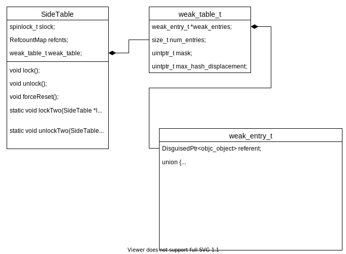

#### 3.4 循环引用

#### 3.4.1 类之间相互引用

由于OC中指针默认为强引用，如果类之间存在引用关系，就可能产生下面这种循环引用，表面上指针已经置 `nil` ，但实际上各自的引用计数为 `1` ，对象所占的空间无法释放，造成内存泄漏。
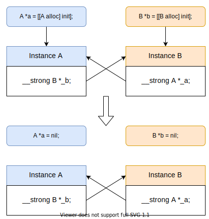

可以使用 `__weak` 或 `__unsafe_retained` 来解决类之间的循环引用，但考虑到编写程序时的安全性，还是推荐使用 `__weak` 。
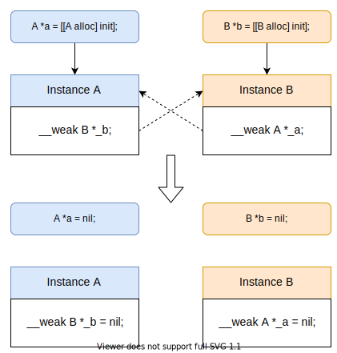

#### 3.4.2 block内的self引用

若类存在block属性，且block中有 `self` 的强引用时，也会产生循环引用。
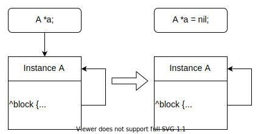

为了解决这个问题，可以传一份 `self` 的弱引用进入block：

```objective-c
__weak typeof(self) weakSelf = self;
self.block = ^{
    [weakSelf doSomthing];
};
```

当然这样写也有可能出问题，因为 `weakSelf` 是弱引用， `self` 一旦释放了， `weakSelf` 就会置 `nil` ，如果有些任务是需要在对象销毁前完成，就需要这样：

```objective-c
__weak typeof(self) weakSelf = self;
self.block = ^{
    __strong typeof(self) self = weakSelf;
    [self doSomthing];
};
```

考虑到易读性和效率， **RAC** (Reactive Cocoa) 给出了一对宏，可以快速达到上面的效果：

```objective-c
@weakify(self);
self.block = ^{
    @strongify(self);
    [self doSomthing];
};
```

### 4 Block

> 可以对比阅读Swift的 闭包 部分

#### 4.1 基本概念

与其他函数中的lambda/匿名函数/闭包类似，OC中的block也是一种可以捕获上下文中变量的无名函数体。
block的形式如下：

```objective-c
返回类型 (^block名称)(参数类型列表) = ^(参数列表){ 函数内容 };

// 例
int x = 2;
void (^pBlock)(int) = ^(int num){ printf("%d", num + x); };
// 打印 4
pBlock(2);
```

#### 4.2 Block捕获

为了保证block内部能正常访问外部上下文中的变量，block有个变量捕获机制：

| 变量类型 | 是否捕获 | 捕获方式 |
| :------: | :------: | :------: |
| 全局变量 | 否 | 直接访问 |
| 局部auto | 是 | 值 |
| 局部static | 是 | 指针 |

局部auto变量被捕获进block后，是 `const` 修饰的，如果想让局部auto变量在block内部也能修改的话，可以在声明变量时加上 `__block` 前缀。

```objective-c
int a = 3;
void (^pBlock)() = ^{ a = 2; };
// Error: Variable is not assignable

__block int b = 3;
void (^qBlock)() = ^{ b = 2; };
qBlock();
// b = 2;
```

#### 4.3 Block本质

block本质上也是一个OC对象，它内部也有个isa指针，它封装了函数调用以及函数调用环境。
block的底层结构如下图所示：
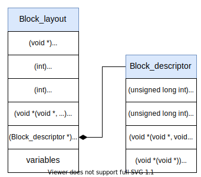

#### 4.4 Block类型

block有3种类型， `__NSGlobalBlock__` 、 `__NSStackBlock__` 、 `__NSMallocBlock__` ，最终都是继承自 `NSBlock` 类型。

| 类型 | 存放位置 | 如何判定 | copy返回值 |
| :------: | :------: | :------- | :------- |
| \_\_NSGlobalBlock\_\_ | 数据区 | 没有捕获局部auto变量 | 自身(单例) |
| \_\_NSStackBlock\_\_ | 栈区 | 捕获了局部auto变量，block执行完就销毁 | 在堆上的一份复制 |
| \_\_NSMallocBlock\_\_ | 堆区 | 1、捕获了局部auto变量，赋给了block指针<br>2、作为Cocoa API/GCD API的参数 | 自身强引用，引用计数+1 |

### 5 多线程

> 可以对比阅读Swift的 多线程 部分

#### 5.1 多线程解决方案

iOS中的每个进程都是由一个或多个线程组成的。每个App默认开启一个主线程(main thread)来处理各种事件和任务。除此之外，也可以创建额外的线程来处理任务。

线程的开启会消耗相应的系统资源。比如在iOS中，每个线程会占用 `1KB` 的空间存储自身信息，除此之外还开辟 `512KB` 的栈空间，其中主线程是 `1MB` 栈空间。因此要控制线程的数量。

iOS中提供了4种多线程的解决方案：

| 方案 | 特点 | 语言| 生命周期 | 使用频率 |
| :------: | :------- | :------:| :------: | :------: |
| pthread | 1、POSIX标准线程库<br>2、跨平台，可移植<br>3、操作难度大 | C | 手动管理 | 低 |
| NSThread | 1、面向对象，与std::Thread类似<br>2、相较于pthread，更简单易用 | OC | 手动管理 | 低 |
| GCD | 1、使用线程池进行自动调度<br>2、充分利用设备性能<br>3、可以设置任务队列的优先级<br>4、无法对任务进行细致操作 | C | 自动管理 | 高 |
| NSOperation | 1、对GCD的封装，面向对象<br>2、可以对任务进行暂停、取消和重用操作 | OC | 自动管理 | 高 |

#### 5.2 NSThread

在大部分业务场景下，NSThread最主要的用途就是以下三种：

+ `[NSThread currentThread]` 获取当前线程信息
+ `[NSThread isMainThread]` 判断当前是否是主线程
+ `[NSThread callStackSymbols]` 获取当前线程栈中信息(打印日志常用)

#### 5.3 GCD

##### 5.3.1 基本概念

+ `block` ：任务，队列的调度单位
+ `queue` ：队列，负责调度任务， **不执行任务** ，底层会维护一个线程池，将任务提交给线程执行
+ `mainQueue` ：主队列，可以理解为主线程的任务队列
+ `globalQueue` ：全局队列，进程内共享的并发队列，由于队列内含有系统调用，不能使用barrier进行阻塞
+ `serialQueue` ：串行队列，维护的线程池中只有一个线程
+ `concurrentQueue` ：并发队列，维护的线程池中有多个线程，比全局队列更“干净”，可以使用barrier
+ `group` ：任务组，可以对多个任务进行集中管理
+ `死锁` ：注意，GCD环境下的死锁往往不是因为 `线程阻塞` 引起的， 而是由 `队列阻塞` 引起的。

##### 5.3.2 任务与队列

提交任务到队列有两种形式：

+ `dispatch_sync` ：将任务 `同步` 提交到队列，等待任务处理完成，<u>可能产生死锁</u>
+ `dispatch_async` ：将任务 `异步` 提交到队列，不作等待

| 提交方式 | 主队列 | 串行队列 | 并发队列 |
| :------: | :------- | :------- | :------- |
| sync | 死锁 | 顺序调度，不会开启新线程，可能死锁 | 顺序调度，不会开启新线程 |
| async | 顺序调度，不会开启新线程 | 顺序调度，开启新线程(一条) | 乱序调度，开启新线程(多条) |

<font color=PaleVioletRed>注意</font>
GCD队列死锁的触发条件其实可以看作：队列与任务相互等待，陷入循环等待的困境。
例如在主队列中同步提交了一个任务，主队列等待该任务的完成，而该任务又要等待主队列中已有任务(例如 `main函数` )执行结束后，才提交给CPU，此时就陷入了队列阻塞，进一步导致了死锁。
更广泛地来看，队列阻塞需要如下的结构：

```objective-c
// queue 为串行队列
dispatch_sync(queue, ^{
    // do someting
    dispatch_sync(queue, ^{
        // 导致阻塞
    });
});
// 或
dispatch_async(queue, ^{
    // do someting
    dispatch_sync(queue, ^{
        // 导致阻塞
    });
});
```

本质上是在某个串行队列的任务中，往该串行队列同步提交了一个任务，导致该队列与新的任务陷入循环等待。
`主队列` 可以看作是一个提交了包裹着 `main函数` 任务的特殊串行队列。

##### 5.3.3 barrier

`dispatch_barrier_async`在并发任务管理中起到一个栅栏的作用，它提交的任务会等待所有位于barrier之前的所有任务执行结束后执行，并且在该任务执行之后，barrier之后的任务才会得到执行。

barrier需要在创建的并发队列中使用，不能在 `global队列` 中使用，因为 `global队列` 中含有系统调用函数，如果使用，等同于 `dispatch_async` ，没有barrier的效果。

```objective-c
// queue 为并发队列
dispatch_async(queue, ^{
    NSLog(@"1");
});
dispatch_async(queue, ^{
    NSLog(@"2");
});
dispatch_barrier_async(queue, ^{
    NSLog(@"3");
});
dispatch_async(queue, ^{
    NSLog(@"4");
});
dispatch_async(queue, ^{
    NSLog(@"5");
});
```

该段代码能保证 `3` 在 `12` 和 `45` 之间输出。

由于barrier的特性，可以用来实现 `多读一写` ，即模拟读写锁。

##### 5.3.4 dispatch_once

`dispatch_once` 能保证任务只会被执行一次，即使同时多线程调用也是线程安全的。常用于 `getInstance` 、 `swizzeld method` 等功能。

```objective-c
// 懒汉式单例
- (instancetype)getInstance {
    static MyManager *instance;
    static dispatch_once_t onceToken;
    dispatch_once(&onceToken, ^{
        instance = [[MyManager alloc] init];
    });
    return instance;
}
```

##### 5.3.5 任务组

`dispatch_group` 是一个组的概念，可以把相关的任务归并到一个组内来执行，通过监听组内所有任务的执行情况来做相应处理。

##### 5.3.5.1 dispatch_group_async

```objective-c
void dispatch_group_async(dispatch_group_t group,
                          dispatch_queue_t queue,
                          dispatch_block_t block);
```

将任务异步提交到指定任务组和队列中执行。

##### 5.3.5.2 dispatch_group_wait

```objective-c
long dispatch_group_wait(dispatch_group_t group, 
                         dispatch_time_t timeout);
```

阻塞当前线程，等待任务组group完成所有任务。
`timeout` 为等待的时间，若超过等待时间或任务完成，则解除对线程的阻塞。
当 `timeout` 设置为 `DISPATCH_TIME_FOREVER` 时，则会一直阻塞当前线程，直到任务完成。

##### 5.3.5.3 dispatch_group_notify

```objective-c
void dispatch_group_notify(dispatch_group_t group,
                           dispatch_queue_t queue, 
                           dispatch_block_t block);
```

类似于通知回调，不会阻塞当前线程，当任务完成时，在指定任务队列queue中调用任务block。

##### 5.3.5.4 dispatch_group_enter / dispatch_group_leave

```objective-c
void dispatch_group_enter(dispatch_group_t group);
void dispatch_group_leave(dispatch_group_t group);
```

类似于信号量，`dispatch_group_enter` 表示组内任务数加一， `dispatch_group_leave` 表示组内任务数减一，当任务数为零时，解除 `dispatch_group_wait` 的阻塞和执行 `dispatch_group_notify` 的block。

虽然任务组会自动判断组内任务的执行情况，但当任务组内嵌套异步任务时，自动判断的结果就可能会出现问题，例如：

```objective-c
NSInteger a = 0;
dispatch_semaphore_t sema = dispatch_semaphore_create(1);

dispatch_group_async(group, queue, ^{
    for (int i = 0; i < 100; i++) {
        dispatch_async(queue, ^{
            [NSThread sleepForTimeInterval:1];
            dispatch_semaphore_wait(sema, DISPATCH_TIME_FOREVER);
            a += 1;
            dispatch_semaphore_signal(sema);
        });
    }
});

dispatch_group_wait(group, DISPATCH_TIME_FOREVER);
printf("%d", a);
```

由于是异步任务不会阻塞当前队列，因此每次循环中的异步提交后，任务组都会认为是完成了一个任务，并不会真的等待异步任务的结束，以至于最后打印出来的 `a` 的值，基本上就不会是 `100` 。

正确的处理方法：

```objective-c
NSInteger a = 0;
dispatch_semaphore_t sema = dispatch_semaphore_create(1);

dispatch_group_enter(group);
for (int i = 0; i < 100; i++) {
    dispatch_async(queue, ^{
        [NSThread sleepForTimeInterval:1];
        dispatch_semaphore_wait(sema, DISPATCH_TIME_FOREVER);
        a += 1;
        dispatch_semaphore_signal(sema);

        dispatch_group_leave(group);
    });
}

dispatch_group_wait(group, DISPATCH_TIME_FOREVER);
printf("%d", a);
```

#### 5.4 NSOperation

NSOperation是一个抽象类，不能直接使用。
有三种使用方法：

+ 使用子类NSInvocationOperation
+ 使用子类NSBlockOperation
+ 自定义继承并实现

##### 5.4.1 特点

`NSOperation` 相较于 `GCD` 有着面向对象的特性，还有更多更便捷的操作。

+ `setMaxConcurrentOperationCount:` 设置最大并发数
+ `addDependency:` 设置队列间的依赖关系(执行顺序)
+ `setQueuePriority:` 设置队列优先级(iOS8之前推荐)
+ `setQualityOfService:` 设置队列服务质量(iOS8之后推荐)
+ `setCompletionBlock:` 设置结束回调
+ `cancelAllOperations` 取消所有任务
+ `setSuspended:` 设置队列是否暂停

>暂停和取消并不代表可以将当前的操作立即取消，而是在当前的操作执行完毕之后不再执行新的操作。

##### 5.4.2 NSInvocationOperation

在当前线程中串行执行，不会开启新线程。
将对象的方法作为任务执行。

##### 5.4.3 NSBlockOperation

并发执行，但不确定是否是在当前线程执行。
类似于GCD，将block作为任务追加执行。
可以多个操作批量执行。

##### 5.4.4 NSOperationQueue

分为主队列 `[NSOperationQueue mainQueue]` 和手动创建的非主队列。

可以将 `NSInvocationOperation` 和 `NSBlockOperation` 加入队列进行串行/并发处理。

#### 5.5 线程安全

线程安全主要通过各种各样的锁来实现。
按性能排序：

+ `OSSpinLock` 自旋锁，iOS10已弃用，存在优先级反转问题
+ `os_unfair_lock` 自选锁，但不忙等， `OSSpinLock`的替代品
+ `dispatch_semaphore_t` 信号量，执行结束时需要回到初始值，否则会崩溃
+ `pthread_mutex_t` 互斥锁，默认非递归，可手动设置
+ `NSLock` 互斥锁，非递归，基于 `pthread_mutex_t`
+ `NSCondition` 条件变量，可广播唤醒
+ `NSRecursiveLock` 互斥锁，`NSLock`的可递归版本
+ `NSConditionLock` 条件变量，对 `NSCondition` 的封装，可进行无条件加锁
+ `@synchronized` 互斥锁，可递归，将临界区限定在大括号内

### 6 运行时Runtime

> 可以对比阅读Swift的 运行时 部分

---

## Swift

---

## iOS开发

### 1 Foundation

#### 1.1 基本概念

`Core Foundation` 是一套 `C` 语言接口， `Foundation` 用 `Objective-C` 封装了 `Core Foundation` 的一套组件，并实现了额外了一些组件供开发人员使用。

`Core Foundation` 中的类型基本以 `CF` 为前缀， `Foundation` 则以 `NS` 为前缀。相比之下， `Core Foundation` 中的类型不受 `引用计数` 的影响，键值存储时也不用遵守 `NSCopying` 协议。两者的大部分类型是可以相互转换的，只需要加上 `__bridge` 的前缀即可。

>在Swift中，Apple重写了部分Foundation中的类型，并去除了 _NS_ 前缀。

##### 1.1.1 类簇

`类簇` 是 `Foundation` 中广泛使用的设计模式。
类簇将一些私有的、具体的子类组合在一个公共的、抽象的超类下面，以这种方法来组织类可以简化一个面向对象框架的公开架构，而又不减少功能的丰富性。

简单的来说， `NSxxx` 是个抽象类，然后它在外层提供了很多方法接口，但是这些方法的实现是由具体 的内部类来实现的。当使用 `NSxxx` 生成一个对象时，初始化方法会判断哪个 **自己内部的类** 最适合生成这个对象，然后这个类就会像 `工厂` 一样，生成这个具体的类对象返回给你。这种又外层类提供统一抽象的接口，然后具体实现让隐藏的，具体的内部类来实现，在设计模式中称为 `抽象工厂` 。

一般情况下是不推荐继承 `Foundation` 中的类簇的，开发者继承的子类是无法调用父类的其他子类的，因为这些子类是通过运行时库内部实现，通常不暴露给开发者使用。

##### 1.1.2 对象复制

+ 浅拷贝
  + `=` 引用计数+1
+ 深拷贝
  + `copy` 用于复制对象副本，返回对象不可修改的副本，潜拷贝
    + 自定义对象需要实现 `NSCopying` 协议
  + `mutableCopy` 用于复制对象可变副本，即使被复制的对象本身不可改变，深拷贝
    + 自定义对象需要实现 `NSMutableCopying` 协议

##### 1.1.3 容器遍历

+ `for( ; ; )` 依赖于下标，能够指定顺序，可以针对下标进行处理
+ `for in` 快速枚举，效率比 `for( ; ; )` 高，但无法指定顺序和针对下标处理
+ 枚举器
  + `enumerateObjectsUsingBlock:` 顺序，可以针对下标，效率不高
  + `NSEnumerationConcurrent` 并发遍历，可以针对下标，效率不高
  + `NSEnumerationReverse` 逆序，可以针对下标，效率不高

#### 1.2 常用对象

##### 1.2.1 NSString 与 NSMutableString

`NSString` 是 `不可变` 字符串，指的是指针指向的字符串序列不可变。
`NSMutableString` 继承自 `NSString` ，是 `可变` 字符串。

`NSString` 是通过 `类簇` 构建的一个抽象类：

| 子类类型 | 存放位置 | 使用的父类 | 如何判定 | 引用计数 |
| :------: | :------: | :------: | :------- | :------: |
| \_\_NSCFConstantString | 数据区 | NSString | 1、static和直接赋值<br>2、initWithString<br>3、与其他在数据区的字符串有相同的字面量 | -1 |
| NSTaggedPointerString | 栈区 | NSString | initWithFormat或copy可变副本，仅包含小于12个ASCII字符<br>(该类型是伪对象，直接将字符串存在指针的地址里，利用指针对齐的特性，最低位设为 `1`，后三位作为标志，可用空间为60bits) | -1 |
| \_\_NSCFString | 堆区 | NSString<br>NSMutableString | 1、通过NSMutableString类型创建<br>2、通过NSString类型创建，且不满足以上两种条件 | 正常 |

>Swift中的NSString中没有 _\_\_NSCFConstantString_ 类型

##### 1.2.2 NSArray 与 NSMutableArray

`NSArray` 是 `不可变` 数组，数组内容不可修改。
`NSMutableArray` 是 `可变` 数组，可以对数组内容进行增删改，变长数组。

OC数组只能存放 **对象** ，无法存放 **基本数据类型**

`NSMutableArray` 为了能够在随机位置的 `insert` 和 `remove` 操作下也能保持一个较高的效率，底层采用了 `环形缓冲区(Circular Buffer)` ，也被称为 `环形队列(Circular Queue)` 。每次插入或删除时，可以选择更靠近端的一侧进行 `memmove` ，充分利用空间并减少元素移动的开销。


##### 1.2.3 集合(Set)

Foundation中的Set都使用了 `拉链法` 的 `hashTable` ，因此查找和插入的复杂度接近 `O(1)` 。

+ `NSSet` 无序、不可变、无重复的集合
+ `NSMutableSet` 无序、可变、无重复的集合，可进行集合运算，继承自 `NSSet`
+ `NSCountedSet` 无序、可变、为重复元素计数的集合，继承自 `NSMutableSet`
+ `NSOderedSet` 有序、不可变、无重复的集合，有索引
+ `NSMutableOrderedSet` 有序、可变、无重复的集合，有索引，继承自 `NSOderedSet`

##### 1.2.4 NSDictionary 与 NSMutableDictionary

`NSDictionary` 是 `不可变` 字典。
`NSMutableDictionary` 继承自 `NSDictionary` ，是 `可变` 字典。

Foundation中的Dictionary都使用了 `拉链法` 的 `hashTable` ，因此查找和插入的复杂度接近 `O(1)` 。
字典使用两个数组分别存储 `key` 和 `object` ，哈希表中以key为键，对应object的下标作为值。数组扩容时，按原有空间的两倍进行扩充。

+ `setObject:ForKey:` 是NSMutableDictionary特有的方法， `object` 不能为 `nil`
+ `setValue:ForKey:` 是KVC的主要方法，当 `value` 为 `nil` 时，自动调用 `removeObject:forKey:` ，约等于啥也没做

##### 1.2.5 NSCache

`NSCache` 是官方提供的缓存类，在一些第三方库中，例如 `AFNetworking` 和 `SDWebImage` ，使用它来管理缓存。

`NSCache` 用法与 `NSMutableDictionary` 的用法很相似，但又有许多优势：

1. NSCache并不会拷贝对象，而是使用 **强引用**
2. NSCache在收到系统发出的 `低内存警告` 时，会清理缓存，遵循 `LRU` 原则
3. NSCache是 **线程安全** 的，不需要加锁控制
4. NSCache可以设定 **对象数量限制** 或 **开销限制**

><font color=PaleVioletRed>注意</font>
>超出数量限制或开销限制时，可能会删减其中的对象，并不意味着一定会删除，所以想通过调整开销值迫使缓存删减对象的情况下，不应使用NSCache。

### 2 Runloop

#### 2.1 基本概念

Runloop通过构建一个事件循环，保证了App处理完所有任务后不会直接退出，而是保持。同时，Runloop并不像一般意义上的死循环，是一种处于占满CPU的忙等的行为，而是通过 `pthread` 和 `mach thread` 进行管理，当没有事件和任务时，线程处于休眠状态，有事件发生时，将线程唤醒，进行处理。

#### 2.2 与线程的关系

Runloop目的是让线程在有工作的时候保持忙碌，因此它们的关系是一一对应的，一个线程只能对应一个Runloop，即在某一时刻，一个线程只能运行一个Runloop。Runloop与线程的关系保存在一个全局的 Dictionary中。

当运行一个应用程序的时候，系统会为应用程序的 `主线程` 创建一个Runloop用来处理主线程上的事件，例如UI刷新和Touch事件。而开启 `子线程` 时，需要 `显式` 获取并运行一个Runloop，否则子线程执行完任务就会退出。

```objective-c
// Objective-C
NSThread *t = [[NSThread alloc] initWithTarget:self selector:@selector(print) object:nil];
[t start];
[self performSelector:@selector(print) onThread:t withObject:nil waitUntilDone:NO];
// 抛出异常 target thread exited
```

```swift
// Swift
let t = Thread(target: self, selector: #selector(printl), object: nil)
t.start()
// 不执行
self.perform(#selector(printl), on: t, with: nil, waitUntilDone: false)
```

Apple并不允许直接创建Runloop，只能通过 `[NSRunLoop currentRunLoop]` 和 `Runloop.current` 来获取当前线程的Runloop。

#### 2.3 Runloop的结构

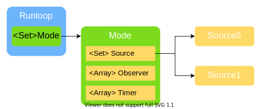

一个Runloop中包含了若干的 `Mode` ，但在实际运行时，只会选择其中一个，如果要切换，就需要先退出再选择一个Mode进入。这样能够有效地分隔不同组的Source/Observer/Timer，让其互不影响。

##### 2.3.1 Mode

一个Mode中包含了若干的 `Source` 、 `Observer` 和 `Timer` ，以上三者统称 `ModeItem` ，ModeItem与Mode有多对一关系。

>当Runloop启动时，选择的Mode中不含有任何ModeItem时，不会进入循环，而是直接退出。

##### 2.3.2 Source

`Source` 是事件源，分为两种类型，区分的标准为是否与 `port` 有关，port即为 `mach_port` ，系统内核端口

+ `source0` 为非port事件，一般是App内部事件，例如 `performSelector:onThread:` 和 `hitTest:withEven:` ，由于只包含了一个回调函数，它并不能主动触发事件。
+ `source1` 为port事件，来自系统内核或其他进程的事件，例如屏幕触摸、网络传输事件，由于包含了一个 `mach_port` 和一个回调函数，可以主动唤醒休眠中的Runloop。

>实际上，有些事件并不是单一的 _source0_ 或 _source1_ ，而是复合型的：
>触摸屏幕时
>-->先被IOKit包装一个事件，由 _mach\_port_ 发送给App，作为 **source1** 唤醒Runloop，这是一个系统注册的事件；
>-->再通过回调函数，将事件分发给 **source0** 处理，这是App内部的触摸事件。

##### 2.3.3 Observer

`Observer` 是观察者，每个Observer都包含了一个回调函数，当Runloop的状态发生变化时，观察者就能通过回调函数接收到这个变化。可以观测的时间点有以下几个：

```objective-c
typedef CF_OPTIONS(CFOptionFlags, CFRunLoopActivity) {
    kCFRunLoopEntry         = (1UL << 0), // 即将进入Loop
    kCFRunLoopBeforeTimers  = (1UL << 1), // 即将处理 Timer
    kCFRunLoopBeforeSources = (1UL << 2), // 即将处理 Source
    kCFRunLoopBeforeWaiting = (1UL << 5), // 即将进入休眠
    kCFRunLoopAfterWaiting  = (1UL << 6), // 刚从休眠中唤醒
    kCFRunLoopExit          = (1UL << 7), // 即将退出Loop
};
```

##### 2.3.4 Timer

`Timer` 是基于时间的触发器，不是一般意义上的定时器，它和 `NSTimer` 是 `toll-free bridged` 的，可以混用。内部包含一个时间长度和一个回调函数。当其加入到 RunLoop 时，RunLoop会注册对应的时间点，当时间点到时，Runloop会被唤醒以执行那个回调。

但由于这样的机制，就会出现 `不准确` 的问题：
**1、** 当Timer所在的线程上出现繁重任务时，如果在触发的时间节点上，Runloop无法处理Timer事件的话，就会放弃本次的处理：

```objective-c
[NSTimer scheduledTimerWithTimeInterval:1 repeats:YES block:^(NSTimer * _Nonnull timer) {
    NSLog(@"Time Out");
}];

// 2秒后模拟一个长达5秒的任务
[self performSelector:@selector(sleepForFive) withObject:nil afterDelay:2];
```

输出结果：

```cpp
16:27:40.902 Time Out
16:27:41.902 Time Out
16:27:46.904 Sleep Over
16:27:46.902 Time Out
16:27:47.902 Time Out
16:27:48.902 Time Out
16:27:49.902 Time Out
```

可见 `42` 、 `43` 、 `44` 、 `45` 这几个时间节点上并没有触发。

**2、** 当Timer所在线程需要处理 `UIScrollview滑动` 时，若Timer在 `NSDefaultRunloopMode` 中，则会受到阻塞，从而变得不准确。

UIScrollview滑动的过程中，Runloop会先退出原来的Mode，切换到 `NSTrackingRunloopMode` 中，原Mode中的Timer就会被阻塞，直到UI事件处理完后，再切换回来，Timer的事件才能够继续被处理。

因此，一般不建议将Timer放在主线程或者需要处理UI的线程上，如果非要使用，可以将Timer注册进 `NSCommonRunloopMode` 或是使用不依赖Runloop的 `dispatch_timer` 。

#### 2.4 Runloop的运行

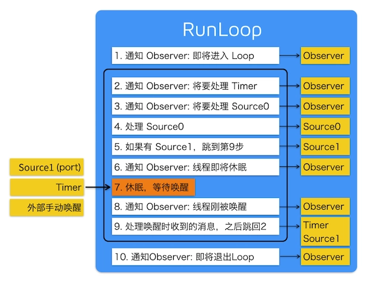

>关于这张图，网上大部分流传的版本中 **Source1(port)** 那块写的都是 **Source0(port)** ...

##### 2.4.1 Runloop 与 autorelease

在不含有Runloop的线程中，自动释放池的销毁是显式指定的；
而在Runloop环境下，自动释放池的销毁是与Runloop有关的。

App启动后，苹果在主线程Runloop里注册了两个 `Observer` ，其回调都是 `_wrapRunLoopWithAutoreleasePoolHandler()` 。

第一个Observer监视的事件是 `即将进入Loop(图中1)` ，其回调内会调用 `_objc_autoreleasePoolPush()` 创建自动释放池。其 `order` 是 $-(2^{31} - 1) = -2147483647$，优先级最高，保证创建释放池发生在其他所有回调之前。

第二个 Observer 监视了两个事件：
**1、** `线程即将休眠(图中6)` 时调用 `_objc_autoreleasePoolPop()` 和 `_objc_autoreleasePoolPush()` 释放旧的池并创建新池；
**2、** `即将退出Loop(图中10)` 时调用 `_objc_autoreleasePoolPop()` 来释放自动释放池。这个Observer的 `order` 是 $2^{31} - 1 = 2147483647$，优先级最低，保证释放池子发生在其他所有回调之后。
在主线程执行的任务，通常是在事件回调、Timer回调内的。这些回调会被Runloop创建好的自动释放池包围，所以一般不需要关注销毁问题。

### 3 UIKit

#### 3.1 MVC

##### 3.1.1 基本概念

MVC是一种将 `数据` 、 `页面` 和 `业务逻辑` 分离的架构，实现了模块化和单一职责原则。

MVC即 `Model-View-Controller` ：

+ `Model` 模型，对数据的定义和管理
+ `View` 视图，与用户交互的页面
+ `Controller` 控制器，负责处理事件，担当数据和视图交流的桥梁

MVC有两套经典的模型：

**1、**
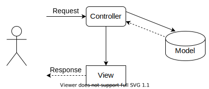
用户请求发送给Controller，Controller需要主动调用Model层的接口去取得实际需要的数据对象，之后将数据发送给需要的View，View渲染之后返回页面给用户。
>在这种情况下，Controller往往会比较大，因为它要知道需要调用哪个Model的接口获取数据对象，还需要知道要把数据对象发送给哪个View去渲染；View和Model都比较简单纯粹，它们都只需要被动地根据Controller的要求完成它们自己的任务就好了。

**2、**
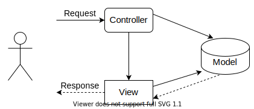
用户请求发送给Controller，Controller调用Model的接口发起数据更新操作，接着就直接转向需要的View；View会调用Model去取得经过Controller更新以后的最新数据，渲染并返回给用户。
>这种情况下，Controller相对就会比较简单，而这里写操作是由Controller发起的，读操作是由View发起的，二者的业务对象模型可以不相同，非常适合需要 _命令查询职责分离_ 的场景，

##### 3.1.2 UIKit的MVC

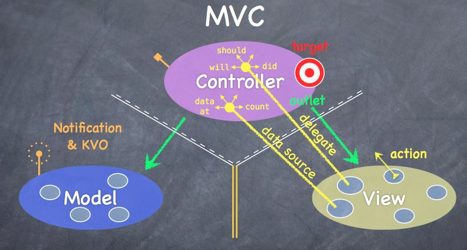
从斯坦福CS193p公开课的一张经典例图可以看出，UIKit中的MVC是类似于第一套经典模型的。

+ View通过 `代理delegate` 和 `数据源data source` 实现了与Controller的通信
+ Controller通过 `outlet` 实现了对View的控制，又通过Model的 `API` 实现的任务的交付
+ Model中通过 `NSNotification` 和 `KVO` 实现了任务处理完后对Controller的通知
+ 做到了View和Model的隔离

#### 3.2 生命周期

##### 3.2.1 UIApplication生命周期

+ `willFinishLaunching` 程序即将完成启动，只在程序启动时执行一次
+ `didFinishLaunching` 程序已经完成启动，将要显示界面了，只在程序启动时执行一次
+ `didBecomeActive` 程序在处于前台时调用
+ `willResignActive` 程序将要进入后台，程序被其他任务强制占用了，就会调用这个方法，所以这个方法也称为程序中断调用方法
+ `didEnterBackground` 程序已经进入后台
+ `willEnterForeground` 程序将要从后台进入前台
+ `willTerminate` 程序将要终止

##### 3.2.2 UIViewController生命周期

UIViewController的生命周期里包含了UIView的生命周期，图中红色部分就是UIView的生命周期

#### 3.3 Interface Builder

Interface Builder(界面生成器)简称IB，于1988年面世，用于OS X和iOS应用的用户界面设计。现在主要有两种设计方式和三种文件：

+ `nib` 二进制数据，是xib文件编译后的产物
+ `xib` 轻量级的设计文件，一般用来设计局部UI界面，本质是 `xml` 文件，可以与 `UIViewController` 和 `UIView` 对应
+ `storyboard` 复杂的设计文件，一般用来描述整个软件的多个界面，并且能展示多个界面之间的跳转关系，本质上是多个xib文件的集合，只能与 `UIViewController` 对应；存在 **难以维护** 、 **性能瓶颈** 、 **错误定位** 困难等问题

#### 3.4 UITableView

UITableView是UIKit中常用的表格视图

##### 3.4.1 UITableViewDelegate

表格视图的代理协议，全是可选实现：

+ 表格内元素显示的生命周期
+ 设置、获取行内属性
+ 管理选择、编辑、删除、移动事件
+ 修改Header和Footr属性
+ 重排
+ 管理视图焦点

##### 3.4.2 UITableViewDataSource

表格视图的数据源协议，两个必须实现：

+ 表格行数
+ 每一行的Cell描述

可选实现：

+ 设置Section区域属性
+ 能否编辑、移动、重排
+ 移动、重排事件的处理

##### 3.4.3 UITableViewCell复用

UITableViewCell就是表格中的单元，如果没有复用机制的话，一份稍微长一点的表格就需要不断创建和销毁Cell，可能存在性能问题和潜在的内存泄漏。

Cell复用的机制类似于对象池，通过 `Identifier` 来指定一个池子，从中复用对象。

>考虑到实际的读取速度和Cell的显示，复用池内的Cell数量一般是比屏幕上能显示的个数要多一些的。

#### 3.5 UINavigationController

##### 3.5.1 结构

UINavigationController本质上是一个 `栈` 结构，不断将ViewController压栈，返回时进行弹栈，也可以不断弹栈直到某一个或者最底下的ViewCOntroller。

+ `pushViewController:animated:` 压栈
+ `popViewControllerAnimated:` 弹栈
+ `popToRootViewControllerAnimated:` 不断弹栈直到栈底
+ `popToViewController:animated:` 不断弹栈直到某个ViewController

##### 3.5.2 UINavigationBarItem

UINavigationBarItem是ViewController自带的属性，但需要在UINavigationController的栈中才能显示，本质上是需要 `UINavigationBar` 作为容器。

#### 3.6 Auto Layout

##### 3.6.1 概念

自动布局Auto Layout源自于 `Cassowary解析工具` 。
`Cassowary算法` 能够有效解析线性等式和线性不等式，而用户的界面中总是会出现不等关系和相等关系，因此就有了 `Cassowary解析工具` ，可以通过 `约束` 来描述视图间关系，约束就是规则，能够表示出一个视图相对于另一个视图的位置。
>iOS12之前，Auto Layout并没有充分利用Cassowary的算法策略，导致约束关系增多时，重新计算的复杂度趋近于指数级。
>iOS12更新后，Auto Layout更多地利用了Cassowary算法策略，使其真正完成了高效的界面线性计算，性能与手写布局接近。

自动布局的计算顺序是由外向里，最先屏幕尺寸，再一层一层往里决定各个元素大小。
>当相关视图发生变化，例如添加、删除和改变尺寸，会进行重新计算，但不会立即布局，而是等到Runloop完成一次迭代时，进行批量重新布局，节省开销。
>如果有即时性要求的话，可以调用 _layoutIfNeeded方法_ ，立即进行布局。

##### 3.6.2 约束

约束是指定视图之间的关系和规则，然后在运行时再将规则转换成视图的frame。
而约束的本质其实是数学公式，例如指定View1在View2之下有8px的距离，其实就是创建一个约束公式：
${View1.top} = 1.0 * {View2.buttom} + 8.0$

更一般的公式：
${View1.attribute} = {mutiplier} * {View2.attribute} + {Constant}$

NSLayoutConstraint中的 `constraintWithItem:attribute:relatedBy:toItem:attribute:multiplier:constant:` 方法就是实现了这一公式。

设定了两个视图之间的约束后，要将约束添加到两个视图最近的父视图中。

#### 3.7 响应者链

##### 3.7.1 基本概念

iOS事件中最常见的就是 `触摸事件UITouch` ，iOS 中不是任何对象都能处理事件，只有继承 `UIResponder` 的对象才能接收并处理事件，称之为 `响应者对象` 。

UIResponder 内部提供了以下方法来处理触摸事件：

+ `touchesBegan:withEvent:` 一根或者多根手指开始触摸view，系统会自动调用view的下面方法
+ `touchesMoved:withEvent:` 一根或者多根手指在view上移动，系统会自动调用view的下面方法，随着手指的移动，会持续调用该方法
+ `touchesEnded:withEvent:` 一根或者多根手指离开view，系统会自动调用view的下面方法
+ `touchesCancelled:withEvent:` 触摸结束前，某个系统事件，例如电话呼入，会打断触摸过程，系统会自动调用view的下面方法

`响应者链ResponderChain` 就是用于确定事件响应者的一种机制，一个事件响应者的完成主要经过两个过程： 1、hitTest 方法首先从顶部 UIApplication 自上而下，直到找到命中者；2、从命中者视图沿着响应者链往上传递寻找可以进行响应的响应者。


##### 3.7.2 hitTest

hitTest的默认流程：

```objective-c
- (UIView *)hitTest:(CGPoint)point withEvent:(UIEvent *)event
{
    // 如果未开启交互，或者透明度小于 0.05 或者 视图被隐藏
    if (self.userInteractionEnabled == NO || self.alpha < 0.05 || self.hidden == YES)
    {
        return nil;
    }
    // 如果 touch 的 point 在 self 的 bounds 内
    if ([self pointInside:point withEvent:event])
    {
        for (UIView *subView in self.subviews)
        {
            //进行坐标转化
            CGPoint coverPoint = [subView convertPoint:point fromView:self];

            // 调用子视图的 hitTest 重复上面的步骤。找到了，返回 hitTestView ,没找到返回有自身处理
            UIView *hitTestView = [subView hitTest:coverPoint withEvent:event];
            if (hitTestView)
            {
                return hitTestView;
            }
        }
        return self;
    }
    return nil;
}
```

默认流程本质上就是基于 “触点是否在当前View中” 进行剪枝的 `DFS` 搜索，但有时候这种剪枝也不一定能得到正确的结果：

因此有些复杂场景是需要自定义的hitTest才能得到想要的响应效果。

### 4 通知

### 5 数据持久化

### 6 CocoaPods

### 7 第三方库
