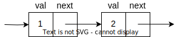

# 数据结构与算法

> 程序 = 数据结构 + 算法

## 1 链表

链表是一种用于存储数据的数据结构，通过如链条一般的指针来连接元素，不像数组对空间有连续分配的要求，可以相对充分地利用闲散空间。

链表插入、删除的时间复杂度为 $O(1)$ ，但随机访问的时间复杂度为 $O(n)$ 。

### 1.1 单链表



### 1.2 双向链表

一般需要头结点和尾结点

>可以结合哈希表，实现 $O(1)$ 的维护操作，也可以实现 `LRU` 算法。

### 1.3 循环链表

即首尾相连的链表，可用来解决约瑟夫环。

## 2 栈

栈是一种 `先进后出FILO` 的数据结构，只允许在固定的一端进行插入和删除元素操作。出栈、入栈、取顶、判空均为 $O(1)$ ，无法随机访问。

>由于递归函数的运行过程即在系统维护的栈上，因此有些情况下可以使用用户维护的栈将递归算法改写为迭代算法，优化运行开销。

### 2.1 单调栈

单调栈即满足单调性的栈结构，是一种算法技巧。
以维护一个整数的单调递增的栈为例：

```cpp
insert x;
while !stack.empty() && stack.top() < x
    stack.pop();
stack.push(x);
```

模版题： [洛谷P5788](https://www.luogu.com.cn/problem/P5788)

## 3 队列

队列是一种 `先进先出FIFO` 的数据结构，只允许在头部插入，尾部删除元素，出队、入队、取头尾、判空均为 $O(1)$ ，无法随机访问。


### 3.1 双端队列

双端队列是可以在两端进行插入删除的特殊队列。


### 3.2 循环队列

与 [循环缓冲区](https://en.wikipedia.org/wiki/Circular_buffer) 类似

使用数组模拟队列会导致一个问题：随着时间的推移，整个队列会向数组的尾部移动，一旦到达数组的最末端，即使数组的前端还有空闲位置，再进行入队操作也会导致溢出（这种数组里实际有空闲位置而发生了上溢的现象被称为 **假溢出** ）。

解决该问题的方法就是将底层的数组视作为一个循环结构，每次下标移动时：

$index\ =\ (index\ +\ offset)\quad \mathrm{mod} \quad length$

这样能够充分利用数组空间。

### 3.3 优先队列

内部会保持一定 `序` 的队列，出队、入队的时间复杂度为 $O(logn)$
>内部实现详见 [二叉堆](#412-二叉堆)

## 4 树

树是 $n\ (n>=0)$ 个结点的有限集。当 $n = 0$ 时，称为空树。在任意一棵非空树中应满足：

1. 有且仅有一个特定的称为根的结点。
2. 当 $n>1$ 时，其余节点可分为 $m\ (m>=0)$ 个互不相交的有限集 $T_1,T_2,…,T_m$ ，其中每个集合本身又是一棵树，称为子树。

显然，树的定义是递归的，即在树的定义中又用到了自身，树是一种递归的数据结构。树作为一种逻辑结构，同时也是一种分层结构，具有以下两个特点：

1. 树的根结点没有前驱，除根结点外的所有结点有且只有一个前驱。
2. 树中所有结点可以有零个或多个后继。

因此 $n$ 个结点的树中有 $n-1$ 条边。

### 4.1 二叉树

二叉树是只有左右子树的树，即每个结点的 `度` 不大于 `2` 。

#### 4.1.1 链式二叉树

使用类似链表的形式，实现的二叉树，也是一般语义下的二叉树。

数据结构：

```c
struct Node {
    Type value;
    Node *left;
    Node *right;
};

struct BiTree {
    Node *root;
};
```

图示：


#### 4.1.2 二叉堆

使用数组实现的二叉树。
但一般不会用来创建一棵普通的二叉树，而是具有特定 `序` 的完全二叉树，即二叉堆。


由图示可见，二叉堆具有以下特性：

1. 数组下标从 `1` 开始
2. 下标 $x$ 的两个子结点为 $2x$ 、 $2x + 1$

一般情况下是按大小关系来定序，例如满足父结点大于所有子结点时，该二叉堆为大顶堆（大根堆），插入一个元素的时间复杂度为 $O(logn)$


#### 4.1.3 递归遍历

##### 4.1.3.1 前序遍历

遍历顺序：根 - 左 - 右

```cpp
void preOrder(BiNode *p) {
    if (p == nullptr) {
        return ;
    }
    cout << p->value;
    preOrder(p->left);
    preOrder(p->right);
}
```

##### 4.1.3.2 中序遍历

遍历顺序：左 - 根 - 右

```cpp
void inOrder(BiNode *p) {
    if (p == nullptr) {
        return ;
    }
    inOrder(p->left);
    cout << p->value;
    inOrder(p->right);
}
```

##### 4.1.3.3 后序遍历

遍历顺序：左 - 右 - 根

```cpp
void postOrder(BiNode *p) {
    if (p == nullptr) {
        return ;
    }
    postOrder(p->left);
    postOrder(p->right);
    cout << p->value;
}
```

#### 4.1.4 迭代遍历

##### 4.1.4.1 前序遍历

思路：

1. 打印当前结点值并将结点压栈，沿左子树不断重复，直到指向空结点
2. 取出栈顶并弹栈，指向该结点的右子树，重复 `1`

```cpp
void preOrder(BiNode *p) {
    if (p == nullptr) {
        return ;
    }
    
    stack<BiNode *> stk;
    BiNode *cur = p;
    while (!stk.empty() || cur) {
        while (cur) {
            cout << cur->value;
            stk.push(cur);
            cur = cur->left;
        }

        cur = stk.top();
        stk.pop();
        cur = cur->right;
    }
}
```

##### 4.1.4.2 中序遍历

思路
同 [前序遍历](#4141-前序遍历) ，改变打印时机，在取出栈顶元素时打印

```cpp
void inOrder(BiNode *p) {
    if (p == nullptr) {
        return ;
    }
    
    stack<BiNode *> stk;
    BiNode *cur = p;
    while (!stk.empty() || cur) {
        while (cur) {
            stk.push(cur);
            cur = cur->left;
        }

        cur = stk.top();
        stk.pop();
        cout << cur->value;
        cur = cur->right;
    }
}
```

##### 4.1.4.3 后序遍历

思路
后序遍历是 `左 - 右 - 根` ，反过来就是 `根 - 右 - 左` ，与前序遍历类似，容易处理。将过程结果保存进另一个栈，最后逐一弹栈就可获得正确的顺序。

```cpp
void postOrder(BiNode *p) {
    if (p == nullptr) {
        return ;
    }
    
    stack<BiNode *> stk;
    stack<Type> res;

    BiNode *cur = p;
    while (!stk.empty() || cur) {
        while (cur) {
            res.push(cur->value);
            stk.push(cur);
            cur = cur->right;
        }

        cur = stk.top();
        stk.pop();
        cur = cur->left;
    }

    while (!res.empty()) {
        cout << res.top();
        res.pop();
    }
}
```

##### 4.1.4.4 层序遍历

每一层单独保存的做法

```cpp
void levelOrder(BiNode *p) {
    if (p == nullptr) {
        return ;
    }

    vector<vector<Type>> res;
    deque<BiNode *> que;
    que.push_back(p);

    BiNode *tmp;
    while (!que.empty()) {
        int n = que.size();
        vector<Type> cur;

        for (int i = 0; i < n; i++) {
            tmp = que.front();
            que.pop_front();

            cur.push_back(tmp->value);
            if (tmp->left) que.push_back(tmp->left);
            if (tmp->right) que.push_back(tmp->right);
        }
        res.emplace_back(cur);
    }
}
```

### 4.2 搜索树

#### 4.2.1 二叉搜索树

#### 4.2.2 平衡二叉树

#### 4.2.3 红黑树

#### 4.2.4 B树

#### 4.2.5 B+树

#### 4.2.6 对比

### 4.3 树状数组

### 4.4 字典树

### 4.5 并查集

## 5 哈希表

## 6 图
