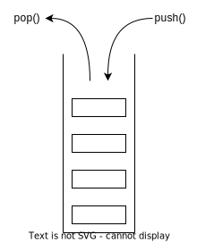

# 数据结构与算法

> 程序 = 数据结构 + 算法

## 1 链表

链表是一种用于存储数据的数据结构，通过如链条一般的指针来连接元素，不像数组对空间有连续分配的要求，可以相对充分地利用闲散空间。

链表插入、删除的时间复杂度为 $O(1)$ ，但随机访问的时间复杂度为 $O(n)$ 。

### 1.1 单链表


### 1.2 双向链表

一般需要头结点和尾结点

>可以结合哈希表，实现 $O(1)$ 的维护操作，也可以实现 `LRU` 算法。

### 1.3 循环链表

即首尾相连的链表，可用来解决约瑟夫环。

## 2 栈

栈是一种 `先进后出LIFO` 的数据结构，只允许在固定的一端进行插入和删除元素操作。出栈、入栈、取顶、判空均为 $O(1)$ ，无法随机访问。

>由于递归函数的运行过程即在系统维护的栈上，因此有些情况下可以使用用户维护的栈将递归算法改写为迭代算法，优化运行开销。

### 2.1 单调栈

单调栈即满足单调性的栈结构，是一种算法技巧。
以维护一个整数的单调递增的栈为例：

```cpp
insert x;
while !stack.empty() && stack.top() < x
    stack.pop();
stack.push(x);
```

模版题： [洛谷P5788](https://www.luogu.com.cn/problem/P5788)

## 3 队列


## 4 树

### 4.1 二叉树

#### 4.1.1 链式二叉树

#### 4.1.2 二叉堆

#### 4.1.3 递归遍历

##### 4.1.3.1 前序遍历

##### 4.1.3.2 中序遍历

##### 4.1.3.3 后序遍历

#### 4.1.4 迭代遍历

##### 4.1.4.1 前序遍历

##### 4.1.4.2 中序遍历

##### 4.1.4.3 后序遍历

##### 4.1.4.4 层序遍历

### 4.2 平衡树

#### 4.2.1 二叉搜索树

#### 4.2.2 平衡二叉树

#### 4.2.3 红黑树

#### 4.2.4 B树

#### 4.2.5 B+树

#### 4.2.6 对比

### 4.3 树状数组

## 5 图
